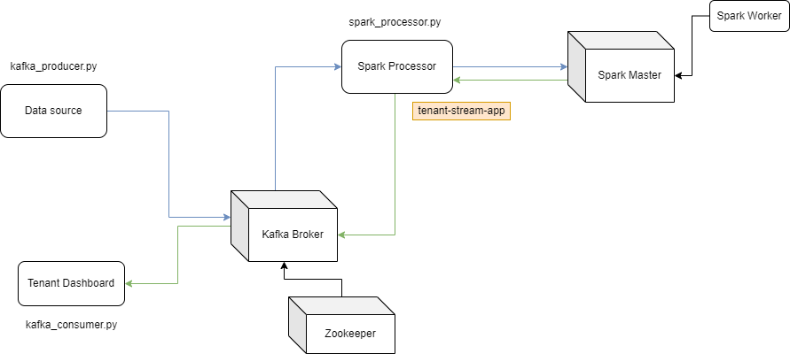

# My Big Data Platform for Network Data Processing with Apache Cassandra and Spark, a Proof of Concept #

This repository provides a design for a multi-tenant big data platform used to process network data in real-time and in batches.

It is the result of my design and programming assignments for the course Big Data Platforms, 
which I followed at Aalto University during the Spring of 2022.

## What I used for this project ##

**Apache Cassandra**
 - for data storage
 - it is a distributed NoSQL database implemented as a cluster of nodes preventing a single point of failure
 
**Apache Spark**
 - for stream processing in near real-time with Spark Streaming libraries
 - used with Resilient Distributed Datasets (RRD), Spark's low-level API
 - uses Hadoop as scheduler
 
**Apache Kafka**
 - to send messages from the data source (client data) to the processor (Spark)
 - messages are published on different topics and are consumed by different agents
 
**Zookeeper**
 - used to orchestrate Kafka brokers
 - brokers send metadata about them and their topics to Zookeeper nodes
 
**Python**
- to write most of the code
- libraries like cassandra.cluser, kafka, pyspark, csv, json
- programs used for
  - in the data ingestion part: an app ingesting a csv file in the Cassandra distributed database
  - in the straming analysis part: Kafka producer and consumer, analyze the message stream received by Kafka brokers

**Docker containers**
- for Kafka brokers
- for Zookeeper nodes
- for a cluster of Apache Cassandra nodes
- for Apache Spark workers and master node
- for the Apache Spark Streaming driver process, an image with the Python code to process the stream

## The structure

## How to navigate the folders

Use the [Deployment Guide](https://github.com/boyscout99/my-big-data-platform/tree/main/deployment#deployment-guide) to deploy all components.
Inside [src](src) you can find a guide on [How to run the code](https://github.com/boyscout99/my-big-data-platform/tree/main/src#how-to-run-the-code) for data ingestion and stream analysis.
You can find the description of the dataset used [here](https://github.com/boyscout99/my-big-data-platform/tree/main/data#description-of-the-data-used-by-the-platform).
