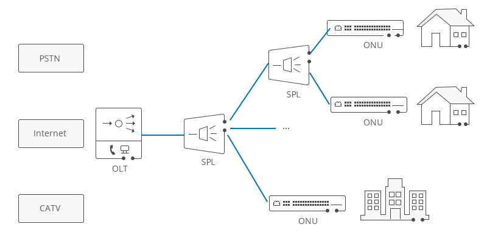

# Description of the data used by the platform

The data ingested by the Big Data Platform comes from around 5M internet users, each belonging to a GPON (Gigabit Passive Optical Network).
The GPON consists of about 10K OLT (Optical Line Terminal) nodes, each one having a network card of 16 GPON ports. Furthermore, each GPON port is composed of up to 64 ONU (Optical Network Unit) interfaces, each of these corresponding to one customer. A OLT node can have around 700-800 customers and contains a network sensor for the data transmitted and received by the customers using that node. Later, about every 5 minutes, the data collected by the sensor is recorded in a document and then transmitted to the central database for storage.
The sensor in the OLT uploads data according to the following format, each row corresponding to the data collected in five minutes from one ONU (customer): 

```
PROVINCECODE, DEVICEID, IFINDEX, FRAME, SLOT, PORT, ONUINDEX, ONUID, TIME, SPEEDIN, SPEEDOUT
HKD,2222771642618,6828878457269,1,1,13,20,222277164261810113020,01/08/2019 11:38:33,2992,2947
HKD,2222771642618,6828878457269,1,1,13,21,222277164261810113021,01/08/2019 11:38:33,31271245,1414548
HKD,2222771642618,6828878457269,1,1,13,2,222277164261810113002,01/08/2019 11:38:33,677495,20658

``` 

Where

- PROVINCECODE: code of the network sector
- DEVICEID: id of the OLT device
- IFINDEX: interface id
- FRAME: frame id
- SLOT: slot id
- PORT: port number
- ONUINDEX: onu index
- ONUID: network interface
- TIME: record time
- SPEEDIN:  traffic moved into an ONU (network interface) measured in bit/s
- SPEEDOUT: traffic moved out an ONU (network interface) measured in bit/s
- BYTEIN: byte coming in during the period of monitoring
- BYTEOUT: byte going out during the period of monitoring

### Throughput

- 1 GPON port: 1.2Gbps upload, 2.4Gbps download
- OLT = 16 (max GPON ports) x 1Gbps

### Current Payload

- with ~10K node there are ~5M sensors (10K OLTs x ~500 customers each)

### Update cycle

- every 5 minutes -> 288 record/sensor/day (24x60/5)

### Total records/day

- 5M x 288 = 1.440 M (records/day)

### Data sizes

- 1 record (one line) ~ 50 byte -> disk size/day = 1.440M x 50 = 72GB/day
- 50 bytes x 5M sensors = 250Mbytes every cycle update

-----

An example of the GPON structure is given in the following picture, where one node (OLT) is used by different customers,
each having his/her own ONU. [[source]](https://community.fs.com/blog/abc-of-pon-understanding-olt-onu-ont-and-odn.html)



-----

## Resources

1. [ABC of PON: Understanding OLT, ONU, ONT and ODN](https://community.fs.com/blog/abc-of-pon-understanding-olt-onu-ont-and-odn.html)
